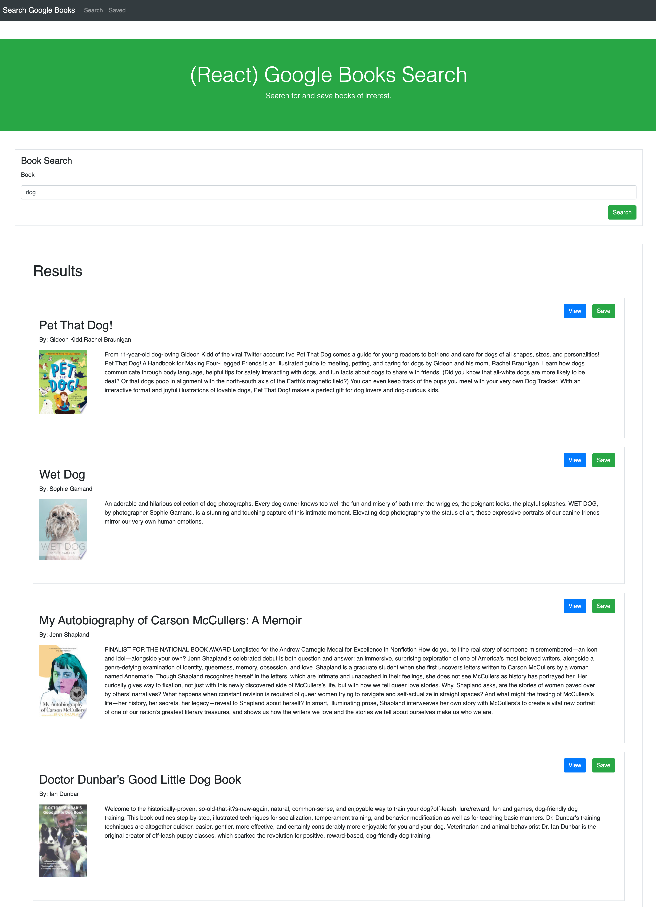
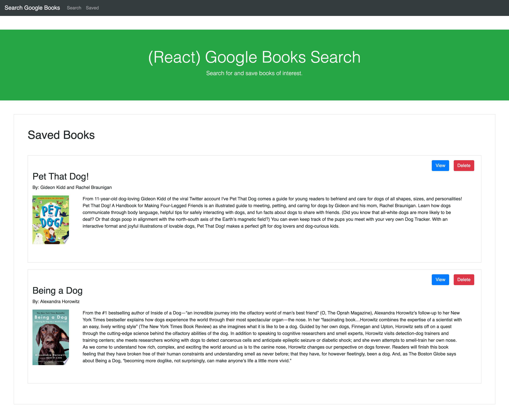

# Google Books Search App

An app that utilizes the MERN tech stack to search and save books from the Google Books API.

## Description

This full-stack application allows users to search for books from the Google Books API and save them to a separate page. When a user enters a valid query, a request to the API is made and the results section of the page is updated. Users can then view more information about each book by clicking a "View" button, and/or click a "Save" button to include that specific book in their list of saved books.

It was challenging to create this application because it was my first real attempt at building and deploying an app using the entire MERN stack. The most challenging aspect of building this application was understanding when and how to use strategies specific to React. I learned a lot about the useEffect hook, and recognized the importance of adding an empty array at the end (to avoid an infinite loop). I also became a lot more familiar and comfortable with the useState hook. One of my favorite things I learned in building this application was recognizing how all technologies in the MERN stack work together. It was really interesting to see the patterns of data being passed from the React front-end to the Express back-end and ultimately to the Mongo database.

A few ideas for future development include:

- Adding additional custom styling to the app
- Creating more error handling (e.g. prevent users from saving the same book twice)
- More user feedback (e.g. an update to the page when the user clicks the save button to verify the book has been saved)

## Technologies Used

- Mongo DB/Mongoose
- Express.js
- React
- Node.js

## Table of Contents

- [Installation](#Installation)
- [Usage](#Usage)
- [License](#License)
- [Contributing](#Contributing)
- [Tests](#Tests)
- [Questions](#Questions)
            
## Installation

The application can be viewed live on Heroku here: https://search-google-books-13.herokuapp.com/

Alternatively, the application can be cloned and run locally. The front-end runs on PORT 3000 and the back-end runs on PORT 3001. Navigate to the correct directory and run ```npm start``` in the command line to do so.

A view of the Search page:



A view of the Saved page:



## Usage

This website is currently designed for only one user to search and save books from the Google Books API.

## License

This project has not yet been licensed, and thus, standard copyright laws apply.
            
## Contributing

Valerie Russell is the sole contributor to this project. 
            
## Tests

There are currently no tests written for this project.
            
## Questions

If you have any questions about this application my GitHub username is vruss14 and you can view my GitHub profile at https://github.com/vruss14.

If you have additional questions, feel free to reach out to me at vruss14@gmail.com.
